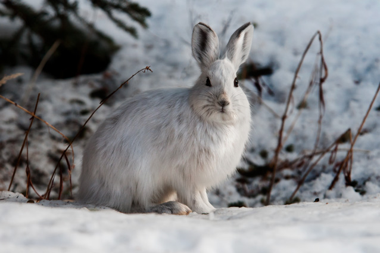

```{r setup, include=FALSE}
knitr::opts_chunk$set(echo = TRUE,
                      warning = FALSE,
                      message = FALSE)
```

<br>

Snowshoe hares are prevalent in northern boreal forests, such as those in Alaska. Capture-release studies conducted from 1999 to 2002 in Alaska's Bonanza Creek Experimental Forest collected physical data on this species (Kielland et al., 2017). This project visualizes snowshoe hare weights in a box-and-whisker plot with a jitter overlay. It also provides some summary statistics on snowshow hare weights.

<center>



</center>


<style>
p.caption {
  font-size: 0.9em;
  font-style: italic;
  color: grey;
  margin-right: 10%;
  margin-left: 15%;  
  text-align: left;
}
</style>


```{r, load packages}

# Load packages

library(tidyverse)
library(kableExtra)
library(janitor)

```

```{r, read in data, results = "hide"}

# Read in data

snowshoe_hares <- read_csv("showshoe_lter.csv")
unique(snowshoe_hares$sex) # check unique values of `sex` column in original data

```

```{r, wrangle data, results = "hide"}

# Wrangle data

hares_wrangle <- snowshoe_hares %>% 
  filter(!is.na(sex)) %>% # remove NAs in sex column
  mutate(sex = str_to_upper(sex)) %>% # Make everything in sex column uppercase
  filter(sex %in% c("M", "F"))  %>% # look for anything in sex column matching "M"/"F" This is how I am getting rid of "?" and "PF"
  filter(!is.na(weight)) # remove NAs in weight column

unique(hares_wrangle$sex) # check unique values of 'sex' column in wrangled data

```

```{r, plot data, fig.align = 'center', fig.cap = "**Figure 1. Female and male snowshoe hare weights** Box-and-whisker plot with overlying jitter showing snowshoe hare body weight (g) for female (F) and male (M) hares at Bonanza Creek Experimental Forest from 1999 to 2002. Data accessed at: https://portal.lternet.edu/nis/mapbrowse?packageid=knb-lter-bnz.55.22"}

# Create graph

hare_boxplot <- ggplot(hares_wrangle, aes(x = sex, y = weight)) +
  geom_boxplot() +
  geom_jitter(width = 0.1, alpha = 0.3, aes(color = sex)) + # Width of jitter, opacity of dots, color coding by sex
  labs (x = "Sex", y = "Body weight (g)", color = "Sex") +
  theme_classic()

hare_boxplot

```

The distrubiton of female and male snowshoe hare weights look pretty similar to each other. Median snowshow hare weight (g) between female and male hares is shown by the center line in the box. The boxes are bounded by the 25th and 75th percentile and the whiskers extend to the last weight observation within one step. These elements of the plot look pretty close between female and male snowshoe hares, with female snowshoe hares having a slightly wider range in body weights.

```{r, summary statistics}

# Create summary statistics

hares_summary <- hares_wrangle %>% 
  group_by(sex) %>% 
  summarize(
    mean = round(mean(weight), 2),
    sd = round(sd(weight), 2),
    median = round(median(weight), 2),
    n = length(sex)
  )

```


```{r, finalize table}

# Create final table

hares_table <- kable(hares_summary, 
                     align = rep('c', 5), 
                     caption = "**Table 1. Summary table of snowshoe hare weights.** Mean, standard deviation, and median weight (g) of snowshoe hares at Bonanza Creek Experimental Forest grouped by sex. Data was collected from 1999 to 2002. Data accessed at: https://portal.lternet.edu/nis/mapbrowse?packageid=knb-lter-bnz.55.22", 
                     col.names = c("Sex","Mean Weight (g)","Standard Deviation (g)","Median Weight (g)", "Sample Size")
                     ) %>% # rename columns
  kable_styling(full_width = F, position = "center", bootstrap_options = c("hover")) # Decrease table width and centers it

hares_table

```

These exploratory summary statistics indicate that the mean weight (g) of female snowshoe hares is greater than that of males. This trend is also reflected in the median weight for female and male hares. After visualizing this data with a box-and-whisker plot, these summary statistics are not suprising. 

<br>
**References:**
<br>
Kielland, K., Chapin, F. S., and Ruess, R. W. (2017). Snowshoe hare physical data in Bonanza Creek Experimental Forest: 1999-Present. [Data set]. Envrionmental Data Initiative. https://doi.org/10.6073/pasta/03dce4856d79b91557d8e6ce2cbcdc14.
